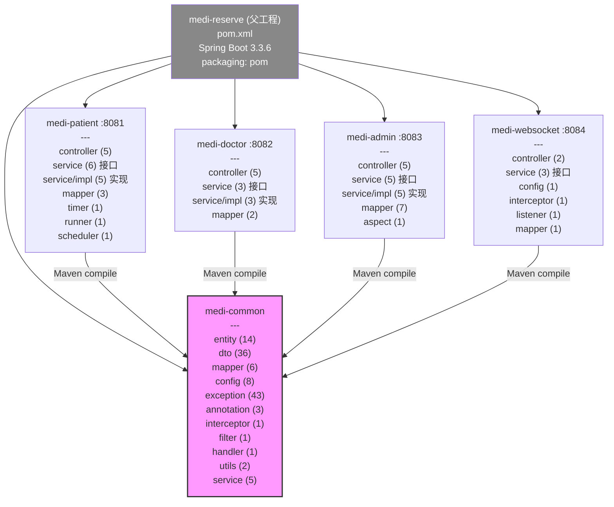
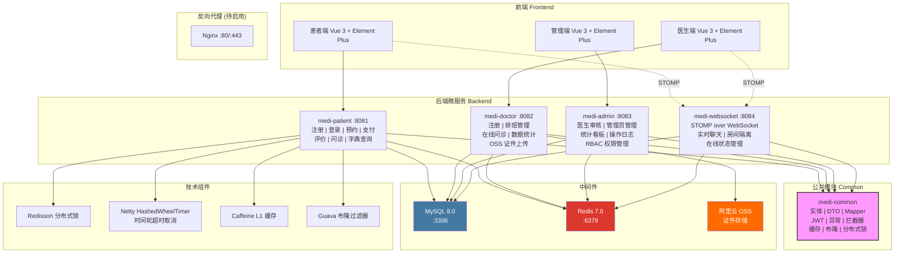

# MediReserve 智慧医疗预约挂号平台 — 项目全景分析报告

> **版本**：v1.0-SNAPSHOT  
> **生成时间**：2026-07-23  
> **分析范围**：`medi-reserve-backend` 全部 5 个子模块，共约 155 个 Java 源文件

---

## 目录

1. [项目总体概述](#1-项目总体概述)
2. [模块依赖关系图](#2-模块依赖关系图)
3. [完整项目结构树](#3-完整项目结构树)
4. [各包详细说明](#4-各包详细说明)
   - [4.1 medi-common 公共模块](#41-medi-common-公共模块)
   - [4.2 medi-patient 患者端](#42-medi-patient-患者端)
   - [4.3 medi-doctor 医生端](#43-medi-doctor-医生端)
   - [4.4 medi-admin 管理端](#44-medi-admin-管理端)
   - [4.5 medi-websocket WebSocket 服务](#45-medi-websocket-websocket-服务)
5. [配置文件分析](#5-配置文件分析)
6. [数据库表结构总结](#6-数据库表结构总结)
7. [整体架构图](#7-整体架构图)
8. [核心业务流程简述](#8-核心业务流程简述)
9. [关键设计模式与技术亮点](#9-关键设计模式与技术亮点)

---

## 1. 项目总体概述

### 1.1 项目定位

**MediReserve** 是一个基于 **Spring Boot 3 + Vue 3** 的智慧医疗预约挂号平台，采用多模块 Maven 架构，覆盖患者端、医生端、管理端三大业务场景，并包含独立的 WebSocket 实时通信服务。

### 1.2 核心业务目标

| 角色 | 核心功能 |
|------|---------|
| **患者** | 注册登录、浏览科室医生、查看排班日历、预约挂号（含分布式锁防超卖）、模拟支付（30分钟超时）、就诊评价（1-5星/匿名）、在线问诊（WebSocket 实时聊天） |
| **医生** | 注册待审核、排班管理（智能推荐号源/停诊/恢复）、在线问诊（查看患者列表/进入聊天室）、数据统计（接诊数/好评率/趋势/评价）、个人信息编辑（含证件上传+审核） |
| **管理员** | 医生审核（通过/驳回/证件变更审核）、管理员管理（添加/禁用/启用）、数据统计看板（总览/趋势/科室排行/医生排行/状态分布）、操作日志审计、RBAC 权限管理 |

### 1.3 技术栈总览

| 类别 | 核心技术 | 版本 |
|------|---------|------|
| 框架 | Spring Boot | 3.3.6 |
| 语言 | JDK | 17 |
| ORM | MyBatis Spring Boot | 3.0.3 |
| 数据库 | MySQL | 8.0 |
| 缓存 L1 | Caffeine | 3.1.8 |
| 缓存 L2 | Redis (Lettuce) | 7.0 |
| 布隆过滤器 | Guava BloomFilter | 33.2.0-jre |
| 分布式锁 | Redisson | 3.27.2 |
| 时间轮定时器 | Netty HashedWheelTimer | 4.1.115 |
| WebSocket | Spring STOMP + SockJS | — |
| 认证 | JJWT | 0.12.5 |
| API 文档 | Knife4j (OpenAPI 3.0) | 4.5.0 |
| 分页 | PageHelper | 2.1.0 |
| 工具 | Hutool | 5.8.26 |
| OSS | 阿里云 OSS + STS | 3.17.4 / 3.1.1 |
| 容器化 | Docker + Docker Compose | 2.x |

---

## 2. 模块依赖关系图



> **说明**：所有业务模块通过 Maven `<dependency>` 依赖 `medi-common` 模块（代码级引用，非 HTTP 调用）。模块间数据共享通过共同访问同一个 MySQL 数据库和 Redis 实例实现。

---

## 3. 完整项目结构树

```
medi-reserve-backend/
│
├── pom.xml                              — 父工程 POM：版本锁定、子模块声明、插件管理
├── docker-compose.yml                   — Docker Compose 编排：MySQL + Redis + 4 微服务 + Nginx
├── Dockerfile                           — 多阶段构建：Maven 构建 → JRE Alpine 运行
├── .env.example                         — 环境变量模板
├── deploy.sh                            — 部署辅助脚本
├── nginx.conf                           — Nginx 主配置
├── medi-reserve.conf                    — Nginx 站点配置
│
├── deploy/
│   └── mysql/
│       └── init.sql                     — 数据库建表脚本（14 张表 + 初始数据）
│
├── medi-common/                         — ★ 公共模块（所有模块的基础依赖）
│   ├── pom.xml
│   └── src/main/java/com/medireserve/common/
│       ├── annotation/                  — 自定义注解
│       │   ├── LogOperation.java        — 操作日志注解（AOP 切点）
│       │   ├── RequirePermission.java   — 权限校验注解
│       │   └── RequireRole.java         — 角色校验注解（拦截器）
│       ├── config/                      — Spring 配置类
│       │   ├── BloomFilterConfig.java   — 布隆过滤器 Bean 定义
│       │   ├── CacheConfig.java         — Redis 缓存管理器配置
│       │   ├── DefaultWebMvcConfig.java — WebMVC 配置（拦截器注册）
│       │   ├── JwtInterceptorProperties.java — JWT 拦截器属性配置类
│       │   ├── Knife4jConfig.java       — API 文档配置
│       │   ├── MultiLevelCacheConfig.java — Caffeine 本地缓存配置
│       │   ├── RedisConfig.java         — Redis 连接 + 序列化配置
│       │   ├── RedissonConfig.java      — Redisson 客户端配置
│       │   └── ResourceConfig.java      — 静态资源映射配置
│       ├── constant/                    — 常量/枚举定义
│       │   ├── CacheKeyConstants.java   — 缓存 Key 常量
│       │   ├── ConsultationStatusConstant.java — 问诊状态常量
│       │   ├── EvaluationStatusConstant.java — 评价状态常量
│       │   ├── MessageConstant.java     — 提示消息常量
│       │   ├── MessageTypeConstant.java — 消息类型常量（文本/图片）
│       │   ├── RoleConstant.java        — 角色常量 + 角色名映射
│       │   ├── StatusCodeConstant.java  — HTTP 状态码常量
│       │   └── StatusConstant.java      — 业务状态常量（排班/预约/审核）
│       ├── dto/                         — 数据传输对象（36 个）
│       │   ├── 认证相关：LoginDTO, PatientRegisterDTO, DoctorRegisterDTO, AdminRegisterDTO
│       │   ├── 个人信息：PatientUpdateDTO, DoctorUpdateDTO, PasswordUpdateDTO
│       │   ├── 预约相关：AppointmentCreateDTO, AppointmentListVO, ScheduleDetailVO, ScheduleCalendarVO
│       │   ├── 排班相关：ScheduleCreateDTO, ScheduleQueryDTO
│       │   ├── 医生相关：DoctorListQueryDTO, DoctorListVO, DoctorPendingVO, DoctorHotVO
│       │   ├── 评价相关：EvaluationCreateDTO, EvaluationListVO, MyEvaluationVO, DoctorEvaluationVO
│       │   ├── 审核相关：AuditRejectDTO, CertificateAuditDTO, DoctorAuditInfoVO, PendingCertAuditVO
│       │   ├── 统计相关：DashboardOverviewVO, TrendDataVO, DailyTrendVO, DepartmentRankingVO, DoctorRankingVO, StatusDistributionVO, DoctorStatisticsOverviewVO
│       │   ├── 问诊相关：SendMessageDTO, ChatMessageVO, ConsultationRoomVO
│       │   ├── 权限相关：PermissionNodeVO, RoleVO, RolePermissionUpdateDTO
│       │   ├── 日志相关：OperationLogQueryDTO, OperationLogVO
│       │   └── OSS：OssStsVO
│       ├── entity/                      — 数据库实体类（14 个）
│       │   ├── Admin.java               — 管理员
│       │   ├── Patient.java             — 患者
│       │   ├── Doctor.java              — 医生
│       │   ├── DoctorAudit.java         — 医生审核资料
│       │   ├── Department.java          — 科室
│       │   ├── Title.java               — 职称
│       │   ├── Schedule.java            — 排班
│       │   ├── Appointment.java         — 预约
│       │   ├── Evaluation.java          — 评价
│       │   ├── ConsultationMessage.java — 问诊消息
│       │   ├── Permission.java          — 权限
│       │   ├── Role.java                — 角色
│       │   ├── RolePermission.java      — 角色-权限关联
│       │   └── OperationLog.java        — 操作日志
│       ├── exception/                   — 业务异常类（43 个）
│       │   ├── 认证异常：AccountNotFoundException, AccountDisabledException, AccountLockedException,
│       │   │            PasswordErrorException, PermissionDeniedException, AuditPendingException,
│       │   │            AuditRejectedException, PhoneAlreadyExistsException, UsernameAlreadyExistsException
│       │   ├── 预约异常：AppointmentNotFoundException, AppointmentDuplicateException,
│       │   │            AppointmentNotPendingException, AppointmentAlreadyPaidException,
│       │   │            AppointmentTimeoutException, AppointmentNotEvaluableException
│       │   ├── 排班异常：ScheduleNotFoundException, ScheduleStoppedException, ScheduleAlreadyFullException,
│       │   │            ScheduleFullException, ScheduleDuplicateException, ScheduleDatePastException,
│       │   │            ScheduleDateNotArrivedException, ScheduleHasAppointmentsException,
│       │   │            ScheduleStatusInvalidException, ScheduleInfoNotFoundException
│       │   ├── 号源异常：InsufficientQuotaException
│       │   ├── 医生/科室异常：DoctorNotFoundException, DoctorAuditNotFoundException,
│       │   │                 DoctorAlreadyAuditedException, DepartmentNotFoundException, TitleNotFoundException
│       │   ├── 评价异常：EvaluationNotFoundException, EvaluationDuplicateException,
│       │   │            EvaluationAlreadyDeletedException, EvaluationCreateFailedException,
│       │   │            EvaluationDeleteFailedException
│       │   ├── 支付异常：PaymentFailedException
│       │   ├── 审核异常：AuditOperationFailedException, RejectReasonEmptyException
│       │   ├── 缓存异常：CacheRefreshFailedException
│       │   ├── 问诊异常：ConsultationException
│       │   ├── 系统异常：SystemBusyException, SystemException
│       │   └── 基础异常：BusinessException（所有业务异常父类）
│       ├── filter/                      — Servlet 过滤器
│       │   └── LoggingFilter.java       — 请求日志过滤器
│       ├── handler/                     — 全局异常处理器
│       │   └── GlobalExceptionHandler.java — 统一异常拦截 → Result 响应
│       ├── interceptor/                 — 拦截器
│       │   └── JwtTokenInterceptor.java — JWT Token 校验拦截器
│       ├── mapper/                      — MyBatis Mapper 接口（6 个公共）
│       │   ├── AppointmentMapper.java   — 预约表 Mapper
│       │   ├── DepartmentMapper.java    — 科室表 Mapper
│       │   ├── DoctorAuditMapper.java   — 医生审核表 Mapper
│       │   ├── DoctorAuthMapper.java    — 医生认证表 Mapper
│       │   ├── PatientAuthMapper.java   — 患者认证表 Mapper
│       │   └── TitleMapper.java         — 职称表 Mapper
│       ├── properties/                  — 配置属性类
│       │   └── OssProperties.java       — OSS 配置属性（@ConfigurationProperties）
│       ├── result/                      — 统一响应结果
│       │   └── Result.java              — 统一返回体 {code, message, data}
│       ├── service/                     — 公共 Service（5 个）
│       │   ├── BloomFilterService.java  — 布隆过滤器数据加载服务
│       │   ├── LoginAttemptService.java — 登录尝试次数限制服务
│       │   ├── MultiLevelCacheService.java — 多级缓存操作服务
│       │   ├── OssStsService.java       — OSS STS 临时凭证服务
│       │   └── PermissionService.java   — 权限查询服务
│       └── utils/                       — 工具类
│           ├── JwtUtil.java             — JWT 令牌生成/解析工具
│           └── PasswordUtil.java        — BCrypt 密码加密/校验工具
│
├── medi-patient/                        — ★ 患者端服务（端口 8081）
│   ├── pom.xml
│   └── src/main/
│       ├── java/com/medireserve/patient/
│       │   ├── PatientApplication.java  — 启动类（@SpringBootApplication）
│       │   ├── controller/              — REST 控制器（5 个）
│       │   │   ├── PatientAuthController.java — 注册/登录/个人信息/密码修改
│       │   │   ├── PatientDoctorController.java — 科室列表/医生列表/排班日历
│       │   │   ├── CommonDictController.java — 科室/职称字典接口
│       │   │   ├── AppointmentController.java — 创建预约/支付/我的预约列表
│       │   │   └── EvaluationController.java — 评价 CRUD/热门医生排行
│       │   ├── service/                 — Service 接口（6 个）
│       │   │   ├── AppointmentService.java
│       │   │   ├── AppointmentTimeoutService.java
│       │   │   ├── CacheEvictService.java
│       │   │   ├── EvaluationService.java
│       │   │   ├── PatientAuthService.java
│       │   │   └── PatientDoctorService.java
│       │   ├── service/impl/            — Service 实现（5 个）
│       │   │   ├── AppointmentServiceImpl.java — 预约核心：分布式锁 + 乐观锁 + 时间轮
│       │   │   ├── AppointmentTimeoutServiceImpl.java — 超时取消（锁 + 事务 + 缓存清除）
│       │   │   ├── EvaluationServiceImpl.java — 评价 CRUD + 热门医生排行（时间衰减算法）
│       │   │   ├── PatientAuthServiceImpl.java — 注册/登录/个人信息/密码修改
│       │   │   └── PatientDoctorServiceImpl.java — 科室/医生查询 + 排班日历
│       │   ├── mapper/                  — Mapper 接口（3 个）
│       │   │   ├── EvaluationMapper.java
│       │   │   ├── PatientDoctorMapper.java
│       │   │   └── PatientScheduleMapper.java
│       │   ├── timer/                   — 时间轮定时器
│       │   │   └── AppointmentTimeoutTimer.java — Netty HashedWheelTimer（30 分钟超时取消）
│       │   ├── runner/                  — 启动任务
│       │   │   └── CacheWarmupRunner.java — 应用启动后缓存预热
│       │   └── scheduler/               — 定时任务
│       │       └── DoctorHotScheduler.java — 每 30 分钟刷新热门医生缓存
│       └── resources/
│           ├── application.yml          — 本地开发配置
│           ├── application-docker.yml   — Docker 环境配置
│           └── mapper/                  — MyBatis XML 映射文件（3 个）
│               ├── EvaluationMapper.xml
│               ├── PatientDoctorMapper.xml
│               └── PatientScheduleMapper.xml
│
├── medi-doctor/                         — ★ 医生端服务（端口 8082）
│   ├── pom.xml
│   └── src/main/
│       ├── java/com/medireserve/doctor/
│       │   ├── DoctorApplication.java   — 启动类
│       │   ├── controller/              — REST 控制器（5 个）
│       │   │   ├── DoctorAuthController.java — 注册/登录/个人信息/密码/证件审核状态查询
│       │   │   ├── ScheduleController.java — 排班 CRUD/智能推荐号源/停诊恢复
│       │   │   ├── DoctorAppointmentController.java — 医生查看预约患者列表
│       │   │   ├── DoctorStatisticsController.java — 总览/趋势/评价列表
│       │   │   └── OssController.java   — OSS STS 临时凭证
│       │   ├── service/                 — Service 接口（3 个）
│       │   │   ├── DoctorAuthService.java
│       │   │   ├── DoctorStatisticsService.java
│       │   │   └── ScheduleService.java
│       │   ├── service/impl/            — Service 实现（3 个）
│       │   │   ├── DoctorAuthServiceImpl.java — 医生注册/登录/信息/密码/证件审核
│       │   │   ├── DoctorStatisticsServiceImpl.java — 个人统计数据查询
│       │   │   └── ScheduleServiceImpl.java — 排班管理 + 智能推荐算法
│       │   └── mapper/                  — Mapper 接口（2 个）
│       │       ├── DoctorStatisticsMapper.java
│       │       └── ScheduleMapper.java
│       └── resources/
│           ├── application.yml          — 本地开发配置（含 OSS 配置）
│           ├── application-docker.yml   — Docker 环境配置
│           └── mapper/                  — MyBatis XML（2 个）
│               ├── DoctorStatisticsMapper.xml
│               └── ScheduleMapper.xml
│
├── medi-admin/                          — ★ 管理端服务（端口 8083）
│   ├── pom.xml
│   └── src/main/
│       ├── java/com/medireserve/admin/
│       │   ├── AdminApplication.java    — 启动类
│       │   ├── controller/              — REST 控制器（5 个）
│       │   │   ├── AdminAuthController.java — 登录/管理员列表/添加/禁用启用/密码修改
│       │   │   ├── AdminAuditController.java — 医生审核（列表/详情/通过/驳回/证件审核）
│       │   │   ├── AdminDashboardController.java — 统计看板（总览/趋势/科室排行/医生排行/状态分布）
│       │   │   ├── OperationLogController.java — 操作日志（列表/详情/删除）
│       │   │   └── PermissionController.java — 权限管理（权限树/角色列表/权限分配）
│       │   ├── service/                 — Service 接口（5 个）
│       │   │   ├── AdminAuditService.java
│       │   │   ├── AdminAuthService.java
│       │   │   ├── AdminDashboardService.java
│       │   │   ├── OperationLogService.java
│       │   │   └── PermissionService.java（实现类，在 impl 包）
│       │   ├── service/impl/            — Service 实现（5 个）
│       │   │   ├── AdminAuditServiceImpl.java — 审核通过/驳回/证件审核
│       │   │   ├── AdminAuthServiceImpl.java — 管理员注册/登录/列表/状态修改
│       │   │   ├── AdminDashboardServiceImpl.java — 统计查询
│       │   │   ├── OperationLogServiceImpl.java — 日志 CRUD + 异步保存
│       │   │   └── PermissionServiceImpl.java — 权限树构建/角色权限查询更新
│       │   ├── mapper/                  — Mapper 接口（7 个）
│       │   │   ├── AdminAuditMapper.java
│       │   │   ├── AdminAuthMapper.java
│       │   │   ├── AdminDashboardMapper.java
│       │   │   ├── OperationLogMapper.java
│       │   │   ├── PermissionMapper.java
│       │   │   ├── RoleMapper.java
│       │   │   └── RolePermissionMapper.java
│       │   └── aspect/                  — AOP 切面
│       │       └── OperationLogAspect.java — @LogOperation 切面（自动记录操作日志）
│       └── resources/
│           ├── application.yml          — 本地开发配置
│           ├── application-docker.yml   — Docker 环境配置
│           └── mapper/                  — MyBatis XML（5 个）
│               ├── AdminAuditMapper.xml
│               ├── AdminDashboardMapper.xml
│               ├── OperationLogMapper.xml
│               ├── PermissionMapper.xml
│               └── RolePermissionMapper.xml
│
└── medi-websocket/                      — ★ WebSocket 服务（端口 8084）
    ├── pom.xml
    └── src/main/
        ├── java/com/medireserve/websocket/
        │   ├── WebsocketApplication.java — 启动类
        │   ├── config/                   — 配置类
        │   │   └── WebSocketConfig.java  — STOMP 端点/消息代理/前缀配置
        │   ├── controller/               — 消息处理器 + REST 接口
        │   │   ├── ChatController.java   — @MessageMapping 消息发送处理
        │   │   └── ConsultationController.java — 问诊室信息/聊天历史/结束问诊
        │   ├── interceptor/              — 握手拦截器
        │   │   └── WebSocketHandshakeInterceptor.java — JWT 认证 + 用户信息提取
        │   ├── listener/                 — 事件监听器
        │   │   └── WebSocketEventListener.java — 连接/断开事件处理（在线状态 + 离线消息）
        │   ├── service/                  — Service 接口（3 个）
        │   │   ├── ConsultationRedisService.java — Redis 在线状态/房间管理/离线消息
        │   │   ├── ConsultationService.java — 问诊权限校验/房间信息/历史/结束
        │   │   └── [impl 实现同包]
        │   └── mapper/                   — Mapper 接口
        │       └── ConsultationMessageMapper.java
        └── resources/
            ├── application.yml           — 本地开发配置
            ├── application-docker.yml    — Docker 环境配置
            └── mapper/                   — MyBatis XML（1 个）
                └── ConsultationMessageMapper.xml
```

---

## 4. 各包详细说明

### 4.1 medi-common 公共模块

> **定位**：所有业务模块的基础依赖，提供实体类、DTO、工具类、配置、异常体系等共享代码。

#### 4.1.1 annotation/ — 自定义注解

| 类名 | 注解类型 | 说明 |
|------|---------|------|
| `LogOperation` | `@Target(METHOD)` `@Retention(RUNTIME)` | 操作日志标记注解，`module` 模块名、`operation` 操作描述、`recordParams` 是否记录参数。被标注的方法由 `OperationLogAspect` 切面拦截 |
| `RequirePermission` | `@Target(METHOD)` `@Retention(RUNTIME)` | 权限校验注解，`value` 为权限代码字符串 |
| `RequireRole` | `@Target({METHOD, TYPE})` `@Retention(RUNTIME)` | 角色校验注解，`value` 为角色常量数组（如 `"PATIENT"` / `"DOCTOR"` / `"SUPER_ADMIN"`）。类级注解设置该类所有方法的默认角色，方法级可覆盖 |

#### 4.1.2 config/ — 配置类

| 类名 | 注解 | 说明 | 核心职责 |
|------|------|------|---------|
| `BloomFilterConfig` | `@Configuration` | 布隆过滤器 Bean 配置 | 创建 `doctorBloomFilter` (10000 预期量, 1% 误判率) 和 `scheduleBloomFilter` (1000000 预期量, 1% 误判率)，用于防止缓存穿透 |
| `CacheConfig` | `@Configuration` | Redis 缓存管理器 | 使用 `RedisCacheManager` + Jackson2Json 序列化，默认 TTL 300 秒（5 分钟） |
| `DefaultWebMvcConfig` | `@Configuration implements WebMvcConfigurer` | WebMVC 全局配置 | 注册 `JwtTokenInterceptor`，配置 Knife4j 静态资源放行 |
| `JwtInterceptorProperties` | `@Configuration` `@ConfigurationProperties("jwt.interceptor")` | JWT 拦截器属性 | 读取 `application.yml` 中的 `jwt.interceptor.exclude-paths` 白名单列表 |
| `Knife4jConfig` | `@Configuration` | API 文档配置 | 各模块单独配置 `springdoc.group-configs`，扫描各自的 Controller 包 |
| `MultiLevelCacheConfig` | `@Configuration` `@EnableCaching` | Caffeine 本地缓存管理器 | `@Primary` 默认缓存管理器，1 小时过期，最大 1000 条，记录统计信息，允许 null 值缓存 |
| `RedisConfig` | `@Configuration` | Redis 序列化配置 | Jackson2Json 序列化，解决 RedisTemplate 默认 JDK 序列化问题 |
| `RedissonConfig` | `@Configuration` | Redisson 客户端 | 单节点模式连接 Redis，用于分布式锁和延迟队列 |
| `ResourceConfig` | `@Configuration implements WebMvcConfigurer` | 静态资源映射 | 配置静态资源处理器 |

#### 4.1.3 constant/ — 常量类

| 类名 | 说明 | 主要常量 |
|------|------|---------|
| `CacheKeyConstants` | 缓存 Key 前缀定义 | `DOCTOR_INFO`, `SCHEDULE_CALENDAR`, `HOT_DOCTOR` 等 |
| `ConsultationStatusConstant` | 问诊状态 | 待问诊、问诊中、已结束 |
| `EvaluationStatusConstant` | 评价状态 | 已发布(1)、已隐藏(2) |
| `MessageConstant` | 提示消息 | 注册成功、登录成功、预约成功、支付成功、评价成功等 50+ 条消息 |
| `MessageTypeConstant` | 消息类型 | 文本(1)、图片(2，预留) |
| `RoleConstant` | 角色常量 | `PATIENT="PATIENT"`, `DOCTOR="DOCTOR"`, `SUPER_ADMIN="SUPER_ADMIN"`, `ADMIN="ADMIN"`，含 `getRoleName()` 方法 |
| `StatusCodeConstant` | HTTP 状态码 | 200、400、401、403、500 等 |
| `StatusConstant` | 业务状态 | 排班状态(正常=1/停诊=2/已满=3)、预约状态(待支付=0/已支付=1/已就诊=2/已取消=3/已过期=4)、审核状态(待审核=0/通过=1/驳回=2) |

#### 4.1.4 entity/ — 实体类（14 个，与数据库表一一对应）

所有实体类使用 Lombok `@Data`，放在 `com.medireserve.common.entity` 包下。

| 类名 | 对应表 | 核心字段 |
|------|--------|---------|
| `Admin` | `admin` | id, username, password, name, phone, email, role, status, lastLoginIp, lastLoginTime |
| `Patient` | `patient` | id, name, phone, password, idCard, gender, status |
| `Doctor` | `doctor` | id, name, phone, password, idCard, gender, birthDate, departmentId, titleId, status（含 `departmentName`、`titleName` 扩展字段） |
| `DoctorAudit` | `doctor_audit` | id, doctorId, certificateUrl, qualificationUrl, specialty, introduction, avatar, auditStatus, auditRemark, auditTime, auditorId, pendingCertificateUrl, pendingQualificationUrl, certAuditStatus, certAuditRemark, certAuditTime, certAuditorId |
| `Department` | `department` | id, name, sortOrder |
| `Title` | `title` | id, name, sortOrder |
| `Schedule` | `schedule` | id, doctorId, scheduleDate, period, maxCount, remainingCount, status |
| `Appointment` | `appointment` | id, appointmentNo, scheduleId, patientId, doctorId, status, createdAt |
| `Evaluation` | `evaluation` | id, appointmentId, patientId, doctorId, scheduleId, score, content, isAnonymous, status |
| `ConsultationMessage` | `consultation_message` | id, appointmentId, senderId, receiverId, senderRole, content, msgType, isRead, sendTime |
| `Permission` | `permission` | id, parentId, code, name, type, sortOrder |
| `Role` | `role` | id, name, description |
| `RolePermission` | `role_permission` | roleId, permissionId |
| `OperationLog` | `operation_log` | id, adminId, adminName, module, operation, method, path, params, ip, result, statusCode, errorMsg, durationMs |

#### 4.1.5 exception/ — 异常体系（43 个类）

所有业务异常继承 `BusinessException extends RuntimeException`。

**分类**：

| 分类 | 异常类（部分列举） | 触发场景 |
|------|-------------------|---------|
| 认证授权 | `AccountNotFoundException`, `PasswordErrorException`, `AuditPendingException`, `AuditRejectedException`, `AccountDisabledException` | 登录校验失败 |
| 预约挂号 | `AppointmentDuplicateException`, `AppointmentNotFoundException`, `AppointmentTimeoutException`, `InsufficientQuotaException` | 预约创建/支付/超时 |
| 排班管理 | `ScheduleNotFoundException`, `ScheduleStoppedException`, `ScheduleDuplicateException`, `ScheduleDatePastException`, `ScheduleHasAppointmentsException` | 排班 CRUD |
| 评价 | `EvaluationDuplicateException`, `EvaluationNotFoundException`, `AppointmentNotEvaluableException` | 评价创建/删除 |
| 系统 | `SystemBusyException`, `SystemException` | 分布式锁获取失败、未知错误 |

全局异常处理器 `GlobalExceptionHandler`（`@ControllerAdvice`）统一捕获所有 `BusinessException` 及其子类，转换为 `Result.error(msg)` 返回。

#### 4.1.6 service/ — 公共 Service 类

| 类名 | 注解 | 核心方法 | 说明 |
|------|------|---------|------|
| `BloomFilterService` | `@Service` | `initDoctorBloomFilter()`, `initScheduleBloomFilter()`, `addDoctor(Long)`, `addSchedule(Long)`, `mightContainDoctor(Long)`, `mightContainSchedule(Long)` | 布隆过滤器数据初始化与查询 |
| `LoginAttemptService` | `@Service` | `loginSuccess(String)`, `loginFailed(String)`, `isBlocked(String)` | 基于 Redis 的登录失败次数限制（推测） |
| `MultiLevelCacheService` | `@Service` | 多级缓存读写操作 | Caffeine L1 + Redis L2 缓存操作封装（推测） |
| `OssStsService` | `@Service` | `getStsCredential(Long userId)` | 调用阿里云 STS AssumeRole，返回临时 AK/SK/Token |
| `PermissionService` | `@Service` | `getPermissionTree()`, `getAllRolesWithPermissions()`, `getPermissionIdsByRoleId(Integer)`, `updateRolePermissions(Integer, RolePermissionUpdateDTO)` | 权限树查询、角色权限管理 |

#### 4.1.7 utils/ — 工具类

| 类名 | 核心方法 | 说明 |
|------|---------|------|
| `JwtUtil` | `createToken(Long userId, String username, String role)`, `parseToken(String token)`, `isTokenExpired(String token)` | 使用 HMAC-SHA256 算法，依赖 `jwt.secret` + `jwt.expiration` 配置 |
| `PasswordUtil` | `encode(String rawPassword)`, `matches(String rawPassword, String encodedPassword)` | 使用 Spring Security BCryptPasswordEncoder |

#### 4.1.8 其他

| 类名 | 包 | 说明 |
|------|-----|------|
| `JwtTokenInterceptor` | `interceptor/` | `HandlerInterceptor` 实现，从 `Authorization` 头提取 Bearer Token，解析 userId/role 存入 `RequestAttributes`，校验 `@RequireRole` 注解 |
| `LoggingFilter` | `filter/` | `Filter` 实现，记录每个 HTTP 请求的 URI、方法、耗时 |
| `Result<T>` | `result/` | 统一响应体：`{code, msg, data}`，静态方法 `success()`, `error()`, `success(String, T)` |
| `OssProperties` | `properties/` | `@ConfigurationProperties("aliyun.oss")` |

---

### 4.2 medi-patient 患者端

#### 4.2.1 启动类

`PatientApplication` — `@SpringBootApplication`，端口 8081

#### 4.2.2 controller/ — 控制器

| 类名 | `@RequestMapping` | 核心接口 | 权限 |
|------|-------------------|---------|------|
| `PatientAuthController` | `/patient` | `POST /register` — 注册，`POST /login` — 登录，`PUT /profile` — 修改个人信息，`PUT /password` — 修改密码 | 注册/登录白名单，其余需 PATIENT |
| `PatientDoctorController` | `/patient` | `GET /departments` — 科室列表，`GET /doctors?department=&keyword=&page=&size=` — 医生列表，`GET /doctors/{id}/schedules` — 排班日历 | 公开 |
| `CommonDictController` | `/patient/dict` | `GET /departments`, `GET /titles`, `GET /all` — 字典数据 | 公开 |
| `AppointmentController` | `/patient` | `GET /schedules/{id}` — 排班详情，`POST /appointments` — 创建预约，`POST /appointments/{id}/pay` — 支付，`GET /appointments` — 我的预约列表 | 部分公开，核心需 PATIENT |
| `EvaluationController` | `/patient` | `POST /evaluations` — 创建评价，`GET /my-evaluations` — 我的评价，`GET /doctors/{id}/evaluations` — 医生评价列表，`DELETE /evaluations/{id}` — 删除评价，`GET /doctors/hot` — 热门医生，`POST /admin/refresh-hot-cache` — 刷新缓存（管理员） | 含公开和需 PATIENT |

#### 4.2.3 service/ — 业务逻辑

| 实现类 | 接口 | 核心方法 | 技术要点 |
|--------|------|---------|---------|
| `AppointmentServiceImpl` | `AppointmentService` | `createAppointment(Long, AppointmentCreateDTO)` — **分布式锁(Redisson) + 乐观锁(SQL `WHERE remaining_count>0`)** + 时间轮超时取消；`payAppointment(Long, Long)` — 乐观锁状态更新；`getMyAppointments(Long, Integer, int, int)` — PageHelper 分页 | `@Transactional` |
| `AppointmentTimeoutServiceImpl` | `AppointmentTimeoutService` | `cancelWithLock(Long)` — 带 Redisson 锁的超时取消（事务 + 回滚号源 + 缓存清除） | `@Transactional` |
| `EvaluationServiceImpl` | `EvaluationService` | `createEvaluation(Long, EvaluationCreateDTO)` — 校验已就诊+未评价；`getHotDoctors()` — 时间衰减算法（近 30 天评价）；`refreshHotDoctorCache()` — 刷新 Redis 热门缓存 | Caffeine 缓存 |
| `PatientAuthServiceImpl` | `PatientAuthService` | `register(PatientRegisterDTO)` — BCrypt 加密+手机号去重；`login(String, String)` — 密码校验；`updateProfile(Long, PatientUpdateDTO)` — 信息修改；`updatePassword(Long, PasswordUpdateDTO)` — 旧密码验证+更新 | BCrypt |
| `PatientDoctorServiceImpl` | `PatientDoctorService` | `getAllDepartments()` — 科室列表+医生数；`getDoctorList(DoctorListQueryDTO)` — 分页筛选+关键词搜索；`getScheduleCalendar(Long)` — 未来 7 天排班日历 | 多级缓存 |

#### 4.2.4 关键组件

| 类名 | 包 | 说明 |
|------|-----|------|
| `AppointmentTimeoutTimer` | `timer/` | 使用 **Netty HashedWheelTimer**（100ms tick，512 槽位），创建预约后调用 `scheduleCancel(id, 30, MINUTES)`；启动时 `@PostConstruct` 扫描数据库超时预约并取消 |
| `CacheWarmupRunner` | `runner/` | `CommandLineRunner` → 启动后预热科室/职称列表到缓存 |
| `DoctorHotScheduler` | `scheduler/` | `@Scheduled(cron="0 0/30 * * * ?")` 每 30 分钟刷新热门医生 Redis 缓存（兜底） |
| `CacheEvictService` | `service/` | 清除指定医生的排班缓存 |

---

### 4.3 medi-doctor 医生端

#### 4.3.1 启动类

`DoctorApplication` — `@SpringBootApplication`，端口 8082

#### 4.3.2 controller/ — 控制器

| 类名 | `@RequestMapping` | 核心接口 | 权限 |
|------|-------------------|---------|------|
| `DoctorAuthController` | `/doctor` | `POST /register` — 注册（待审核），`POST /login` — 登录（含审核状态校验），`PUT /password` — 修改密码，`PUT /profile` — 修改个人信息（普通立即生效，证件提交审核），`GET /profile/audit-status` — 查询证件审核状态 | 注册/登录白名单，其余 DOCTOR |
| `ScheduleController` | `/doctor` | `GET /schedules/recommend` — 智能推荐号源，`POST /schedules` — 新增排班，`GET /schedules` — 查询排班，`PATCH /schedules/{id}/status` — 停诊/恢复，`DELETE /schedules/{id}` — 删除排班 | 类级 `@RequireRole(DOCTOR)` |
| `DoctorAppointmentController` | `/doctor` | `GET /appointments?date=&status=&page=&size=` — 预约患者列表 | DOCTOR |
| `DoctorStatisticsController` | `/doctor/statistics` | `GET /overview` — 总览统计，`GET /trend?days=7` — 每日接诊趋势，`GET /evaluations?page=&size=` — 评价列表 | DOCTOR |
| `OssController` | `/doctor/oss` | `GET /sts-token` (或 `/sts`) — 获取 OSS STS 临时凭证 | DOCTOR |

#### 4.3.3 service/ — 业务逻辑

| 实现类 | 核心方法 | 说明 |
|--------|---------|------|
| `DoctorAuthServiceImpl` | `register(DoctorRegisterDTO)` — 校验手机号→创建 doctor+doctor_audit（状态待审核）；`login(String, String)` — 密码校验 + 审核状态校验（通过才能登录）；`updateProfile(Long, DoctorUpdateDTO)` — 普通信息直接更新，证件信息将 URL 写入 `pending_*` 字段、状态设为待审核 | BCrypt + OSS |
| `ScheduleServiceImpl` | `createSchedule(Long, ScheduleCreateDTO)` — 校验日期+重复+创建；`getRecommendedMaxCount(Long, LocalDate, int)` — 基于历史同 weekday 数据智能推荐；`updateScheduleStatus(Long, int, Long)` — 停诊/恢复；`deleteSchedule(Long, Long)` — 需无预约记录 | — |
| `DoctorStatisticsServiceImpl` | `getOverview(Long)` — 总接诊数/好评率/平均评分/今日接诊；`getTrend(Long, int)` — 按天统计；`getEvaluations(Long, int, int)` — 分页评价 | — |

---

### 4.4 medi-admin 管理端

#### 4.4.1 启动类

`AdminApplication` — `@SpringBootApplication`，端口 8083

#### 4.4.2 controller/ — 控制器

| 类名 | `@RequestMapping` | 核心接口 | 权限 |
|------|-------------------|---------|------|
| `AdminAuthController` | `/admin` | `POST /login` — 登录，`POST /register` — 添加管理员（仅超级管理员），`GET /list` — 管理员列表，`PATCH /{id}/status` — 禁用/启用，`PUT /password` — 修改密码 | 登录白名单，其余 SUPER_ADMIN |
| `AdminAuditController` | `/admin` | `GET /doctors/pending` — 待审核列表，`GET /doctors/{id}/audit-detail` — 审核详情，`PATCH /doctors/{id}/approve` — 通过，`PATCH /doctors/{id}/reject` — 驳回，`GET /cert-pending` — 待审核证件列表，`GET /{doctorId}/cert-pending-detail` — 证件详情，`PATCH /{doctorId}/cert-audit` — 审核证件 | SUPER_ADMIN |
| `AdminDashboardController` | `/admin/dashboard` | `GET /overview` — 总览，`GET /trend?days=` — 趋势，`GET /department-ranking?limit=` — 科室排行，`GET /doctor-ranking?limit=&sortBy=` — 医生排行，`GET /status-distribution` — 状态分布 | SUPER_ADMIN |
| `OperationLogController` | `/admin/operation-logs` | `GET` — 列表（支持按操作人/模块/时间/结果筛选），`GET /{id}` — 详情，`DELETE /{id}` — 删除 | SUPER_ADMIN |
| `PermissionController` | `/admin/permissions` | `GET /tree` — 权限树，`GET /roles` — 角色列表，`GET /roles/{roleId}/permissions` — 角色权限ID列表，`PUT /roles/{roleId}/permissions` — 更新角色权限 | SUPER_ADMIN |

#### 4.4.3 AOP 切面

| 类名 | 注解 | 说明 |
|------|------|------|
| `OperationLogAspect` | `@Aspect` `@Component` | `@Around("@annotation(LogOperation)")`，拦截所有标注 `@LogOperation` 的方法，自动提取：模块名、操作描述、请求方法、请求路径、请求参数（JSON）、客户端IP、执行耗时、成功/失败状态、错误信息；通过 `OperationLogService.saveLogAsync()` 异步保存 |

---

### 4.5 medi-websocket WebSocket 服务

#### 4.5.1 启动类

`WebsocketApplication` — `@SpringBootApplication`，端口 8084

#### 4.5.2 config/ — WebSocket 配置

`WebSocketConfig` (`@Configuration` `@EnableWebSocketMessageBroker`)

| 配置项 | 值 | 说明 |
|--------|-----|------|
| 端点 | `/ws/chat` | 前端 WebSocket 连接地址，支持 SockJS |
| 跨域 | `*` | 允许所有域名（开发环境） |
| 应用前缀 | `/app` | 客户端发送消息到 `/app/xxx`，由 `@MessageMapping` 处理 |
| 广播代理 | `/topic` | 房间广播频道 |
| 点对点代理 | `/user` | 点对点消息前缀 |

#### 4.5.3 关键组件

| 类名 | 包 | 核心方法 | 说明 |
|------|-----|---------|------|
| `ChatController` | `controller/` | `@MessageMapping("/chat.send") sendMessage(SendMessageDTO, SimpMessageHeaderAccessor)` — 认证校验 → 权限校验 → XSS 过滤 → 持久化 MySQL → 广播 `/topic/room/{appointmentId}` → 离线消息暂存 Redis | 核心消息处理器（`@Controller`，非 `@RestController`） |
| `ConsultationController` | `controller/` | `GET /consultation/room/{appointmentId}` — 问诊室信息，`GET /consultation/history/{appointmentId}` — 聊天历史，`POST /consultation/end/{appointmentId}` — 结束问诊 | REST 接口 |
| `WebSocketHandshakeInterceptor` | `interceptor/` | `beforeHandshake()` — 从 URL Query String 提取 `token` 参数，解析 JWT→userId/role，存入 Session Attributes | 握手认证 |
| `WebSocketEventListener` | `listener/` | `handleSessionConnected()` — 标记在线 (Redis) + 加入房间 + 推送离线消息；`handleSessionDisconnected()` — 标记离线 + 离开房间 | 监听 `SessionConnectEvent`/`SessionDisconnectEvent` |
| `ConsultationRedisService` | `service/` | `userOnline(userId, sessionId)`, `userOffline(userId)`, `isOnline(userId)`, `joinRoom(appointmentId, userId)`, `leaveRoom(appointmentId, userId)`, `storeOfflineMessage(receiverId, message)`, `getAndClearOfflineMessages(userId)` | Redis 管理在线状态、房间、离线消息 |

---

## 5. 配置文件分析

### 5.1 父工程 POM (`pom.xml`) 关键配置

```xml
<!-- Spring Boot 父依赖 -->
<parent>
    <groupId>org.springframework.boot</groupId>
    <artifactId>spring-boot-starter-parent</artifactId>
    <version>3.3.6</version>
</parent>

<!-- 统一属性 -->
<properties>
    <java.version>17</java.version>
    <knife4j.version>4.5.0</knife4j.version>
    <mybatis-spring-boot.version>3.0.3</mybatis-spring-boot.version>
    <jwt.version>0.12.5</jwt.version>
    <hutool.version>5.8.26</hutool.version>
    <redisson.version>3.27.2</redisson.version>
    <!-- 构建跳过测试 -->
    <skipTests>true</skipTests>
</properties>

<!-- 子模块 -->
<modules>
    <module>medi-common</module>
    <module>medi-patient</module>
    <module>medi-doctor</module>
    <module>medi-admin</module>
    <module>medi-websocket</module>
</modules>
```

### 5.2 各模块配置文件对比

| 配置项 | patient (8081) | doctor (8082) | admin (8083) | websocket (8084) |
|--------|:---:|:---:|:---:|:---:|
| **数据源** | jdbc:mysql://localhost:3306/medi_reserve | 同 | 同 | 同 |
| **Redis** | localhost:6379, db=0, lettuce pool | 同 | 同 | 同 |
| **JWT secret** | your-256-bit-secret-key... | 同 | 同 | 同 |
| **JWT 有效期** | 7200000ms (2小时) | 同 | 同 | 同 |
| **JWT 白名单** | /patient/login, /patient/register, /patient/dict/**, /patient/departments, /patient/doctors/** | /doctor/login, /doctor/register | /admin/login | (无业务登录接口) |
| **MyBatis** | classpath*:mapper/**/*.xml, map-underscore-to-camel-case=true, StdOutImpl 日志 | 同 | 同 | 同 |
| **Actuator** | health 端点 | 同 | 同 | 同 |
| **OSS 配置** | — | ✓ (endpoint, bucket, sts, access-key, role-arn, timeout=1800s, base-dir=medi) | — | — |
| **Redis 缓存 TTL** | — | — | 300000ms (5分钟) | — |
| **default-price** | — | — | 10 (元) | — |
| **Docker Profile** | `application-docker.yml` — 所有连接改为 Docker 服务名 `mysql`/`redis`，日志级别 INFO | 同 | 同 | 同 |

### 5.3 Docker Compose 环境变量 (`.env.example`)

```bash
MYSQL_ROOT_PASSWORD=123456
MYSQL_DATABASE=medi_reserve
REDIS_PASSWORD=
JWT_SECRET=your-256-bit-secret-key-must-be-long-enough-1234567890
ALIYUN_ACCESS_KEY_ID=
ALIYUN_ACCESS_KEY_SECRET=
ALIYUN_ROLE_ARN=acs:ram::123456789:role/medi-oss-role
```

---

## 6. 数据库表结构总结

| 表名 | 中文名 | 行数（初始） | 核心关系 |
|------|--------|:---:|------|
| `admin` | 管理员表 | 2 | 登录管理后台 |
| `patient` | 患者表 | 0 | 注册后使用 |
| `doctor` | 医生表 | 0 | FK → department, FK → title |
| `doctor_audit` | 医生审核资料表 | 0 | 1:1 doctor (级联删除) |
| `department` | 科室字典表 | 8 | 内科/外科/儿科/妇产科/骨科/眼科/皮肤科/中医科 |
| `title` | 职称字典表 | 5 | 主任/副主任/主治/住院/医师 |
| `schedule` | 排班表 | 0 | FK → doctor, UNIQUE(doctor_id, date, period) |
| `appointment` | 预约记录表 | 0 | FK → schedule/patient/doctor |
| `evaluation` | 就诊评价表 | 0 | UNIQUE(appointment_id) — 一个预约只能评价一次 |
| `consultation_message` | 问诊消息表 | 0 | FK → appointment |
| `permission` | 权限表 | 13 | 树形结构 (parent_id) |
| `role` | 角色表 | 2 | 超级管理员/普通管理员 |
| `role_permission` | 角色权限关联表 | 17 | PK(role_id, permission_id) |
| `operation_log` | 操作日志表 | 0 | 管理员操作审计 |

> 详细的 ER 图及字段说明见 [数据库 ER 图文档](ER_DIAGRAM.md)。

---

## 7. 整体架构图



---

## 8. 核心业务流程简述

### 8.1 预约挂号完整链路

```
患者选择医生 → 查看排班日历（未来7天） → 选择时段 → 确认预约
    ↓
1. 业务校验：排班日期/状态/重复预约
2. 分布式锁：Redisson.getLock("lock:schedule:" + scheduleId).tryLock(3s, 15s)
3. 乐观锁扣号源：UPDATE schedule SET remaining = remaining - 1 WHERE id = ? AND remaining > 0
4. 插入预约记录：appointment (status=0 待支付)
5. 清除排班缓存
6. 时间轮倒计时：timer.scheduleCancel(appointmentId, 30, MINUTES)
7. 释放分布式锁
    ↓
30分钟内 → 患者模拟支付 → 乐观锁改状态为已支付 (status=1)
超时未支付 → HashedWheelTimer 回调 → 分布式锁 + 取消预约 (status=3) + 回滚号源
```

### 8.2 超时取消机制

- 使用 **Netty HashedWheelTimer**（100ms tick，512 槽位）
- 创建预约后调用 `scheduleCancel(id, 30, TimeUnit.MINUTES)`
- 30 分钟后触发 `CancelTask.run()` → `AppointmentTimeoutService.cancelWithLock()`
- `cancelWithLock` 包含：Redisson 锁 + 校验状态 + 更新 status=3 + 回滚 `remaining_count + 1` + 清除缓存
- 启动时 `@PostConstruct` 扫描数据库中所有超时待支付预约并取消

### 8.3 热门医生排行

- 算法：**时间衰减加权评分**（考虑评价时间，近 30 天评价权重更高）
- 查询入口：`GET /patient/doctors/hot`（公开）
- 缓存策略：结果存入 Redis，设置合理 TTL
- 刷新机制：
  1. 新评价创建时主动刷新
  2. 定时任务每 30 分钟兜底刷新 (`DoctorHotScheduler`)
  3. 管理员手动刷新 (`POST /patient/admin/refresh-hot-cache`)

### 8.4 WebSocket 在线问诊

```
前端连接: ws://localhost:8084/ws/chat?token=xxx&appointmentId=1001
    ↓
WebSocketHandshakeInterceptor 解析 Token → userId/role
    ↓
WebSocketEventListener 标记在线 (Redis) + 加入房间 + 推送离线消息
    ↓
患者/医生发送消息: SEND /app/chat.send {appointmentId, receiverId, content}
    ↓
ChatController.sendMessage():
  1. 认证校验 (Session Attributes: userId, role)
  2. 业务校验 (预约归属)
  3. XSS 过滤 (<>< >>)
  4. 持久化 (INSERT consultation_message)
  5. 广播: /topic/room/{appointmentId} (房间里所有人)
  6. 离线检查: 若接收者不在线 → Redis 暂存离线消息
    ↓
任一方 POST /consultation/end/{appointmentId} → 预约状态变为已就诊
```

---

## 9. 关键设计模式与技术亮点

### 9.1 分布式锁 + 乐观锁（防超卖）

- **场景**：高并发下多个患者同时预约同一排班的最后一个号源
- **方案**：
  1. **Redisson 分布式锁**：`lock:schedule:{scheduleId}`，等待 3s，持有 15s
  2. **数据库乐观锁**：`UPDATE schedule SET remaining = remaining - 1 WHERE id = ? AND remaining_count > 0`（`affected_rows = 0` 即号源不足）
- **双重保障**：分布式锁防并发竞争，乐观锁防数据错误

### 9.2 Netty HashedWheelTimer 时间轮

- **替代方案**：相比 `ScheduledExecutorService` 或 `@Scheduled`，时间轮 O(1) 插入，内存占用低，适合海量预约超时任务
- **配置**：tick=100ms，512 槽位，约 51.2 秒一圈
- **生命周期**：实现 `DisposableBean`，应用关闭时自动 `timer.stop()`

### 9.3 多级缓存（Caffeine L1 + Redis L2）

- **L1 Caffeine**：`@Primary` 默认缓存管理器，1 小时 TTL，最大 1000 条，本地访问 < 1ms
- **L2 Redis**：跨实例共享，300s TTL，Jackson2Json 序列化
- **防穿透**：Guava 布隆过滤器（医生 ID 预期 10000，排班 ID 预期 100 万，误判率 1%）+ Caffeine 空值缓存
- **缓存清除**：创建预约 → 清除该医生排班缓存；评价创建 → 刷新热门医生缓存

### 9.4 RBAC 权限管理

- **权限表**：树形结构（`parent_id`），`code` 格式为 `模块:子模块:操作`（如 `admin:audit:approve`）
- **角色表**：超级管理员（role=1，全部 13 条权限）、普通管理员（role=2，4 条查看权限）
- **校验方式**：`@RequireRole` 注解 + `JwtTokenInterceptor` 解析 JWT 中的 role；`@RequirePermission` 注解 + DB 查询
- **角色权限分配**：全量覆盖式更新（`DELETE + INSERT`），而非增量修改

### 9.5 AOP 操作日志

- **注解**：`@LogOperation(module, operation, recordParams)`
- **切面**：`OperationLogAspect.@Around` → 提取模块/操作/方法/路径/IP/请求参数/耗时/结果状态
- **异步保存**：`OperationLogService.saveLogAsync()`，不阻塞主业务
- **覆盖模块**：认证管理、审核管理、排班管理、预约管理、评价管理、权限管理、日志管理等

### 9.6 异常体系设计

- 所有业务异常继承 `BusinessException extends RuntimeException`
- 43 个精细化异常类，覆盖认证、预约、排班、评价、审核、支付、系统等场景
- `GlobalExceptionHandler`（`@ControllerAdvice`）统一拦截，转换为 `Result.error(msg)` 返回
- 前端能根据异常类型展示精准的错误提示

### 9.7 OSS STS 安全上传

- 医生证件上传不经过后端中转，前端直接上传到阿里云 OSS
- 后端通过 **STS AssumeRole** 生成临时 AK/SK/Token（有效期 30 分钟）
- 前端用临时凭证直接调用 OSS SDK，安全且高效
- 上传目录按 `medi/{userId}/` 隔离

### 9.8 其他技术点

| 技术点 | 说明 |
|--------|------|
| BCrypt 密码加密 | `PasswordUtil` 使用 Spring Security BCrypt，不可逆 |
| JWT 无状态认证 | HMAC-SHA256，2 小时有效期，`JwtTokenInterceptor` 白名单放行 |
| PageHelper 分页 | Controller 参数校验（min/max），Service 调用后构建 PageInfo |
| 缓存预热 | `CacheWarmupRunner` 启动后加载科室/职称列表 |
| SockJS 兼容 | WebSocket 服务支持 SockJS，兼容不原生支持 WebSocket 的浏览器 |
| XSS 防御 | WebSocket 消息发送时服务端转义 `<` `>` 字符 |
| 离线消息 | Redis 队列暂存，用户上线时 `WebSocketEventListener` 自动补发 |
| 健康检查 | Spring Boot Actuator `/actuator/health`，Docker Compose `depends_on` 依赖 |

---

> **相关文档**：[部署文档](DEPLOY.md) · [用户操作手册](USER_MANUAL.md) · [数据库 ER 图](ER_DIAGRAM.md) · [项目架构图](ARCHITECTURE.md)