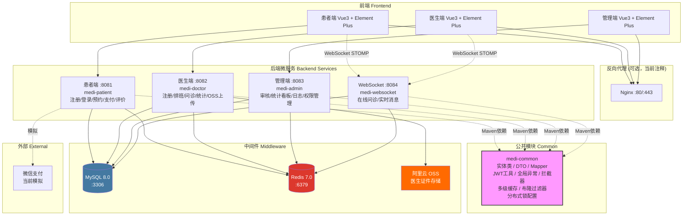
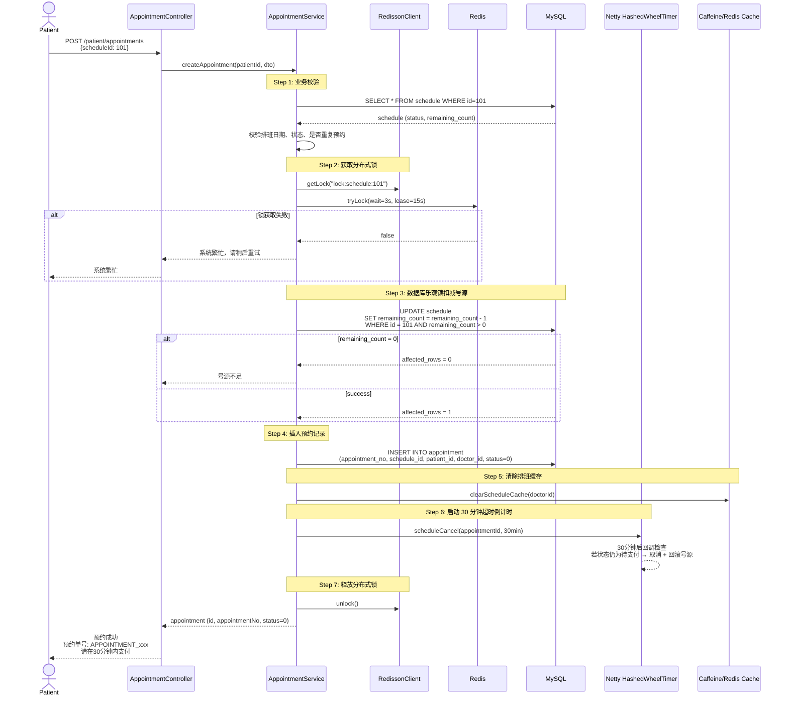
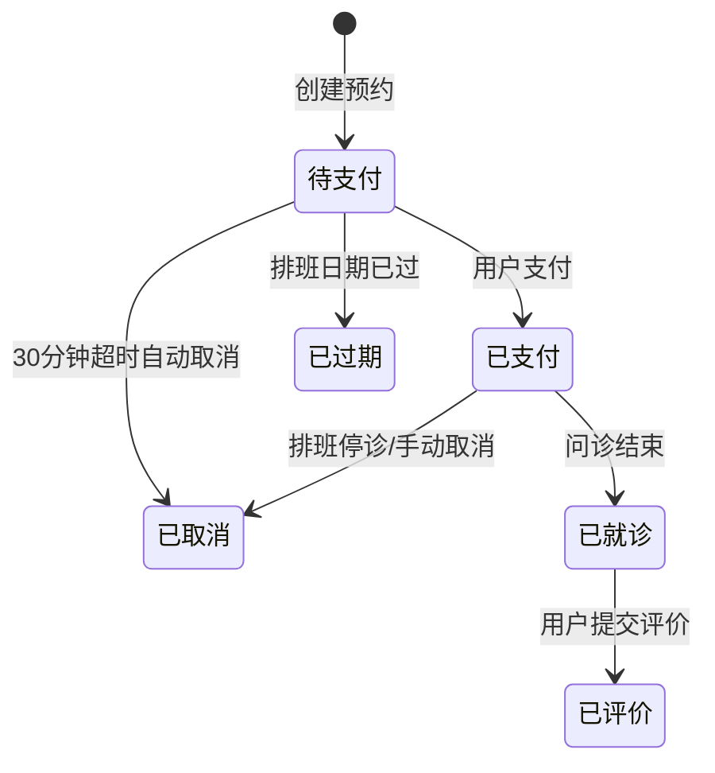
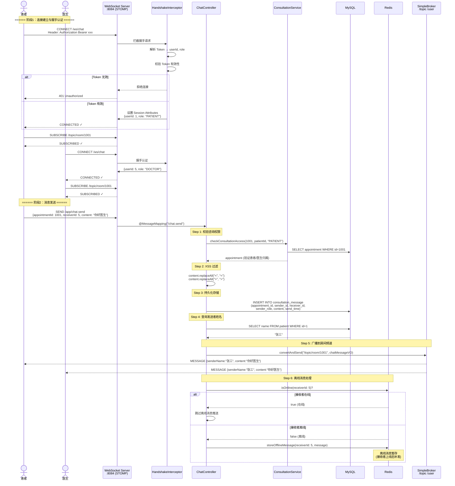
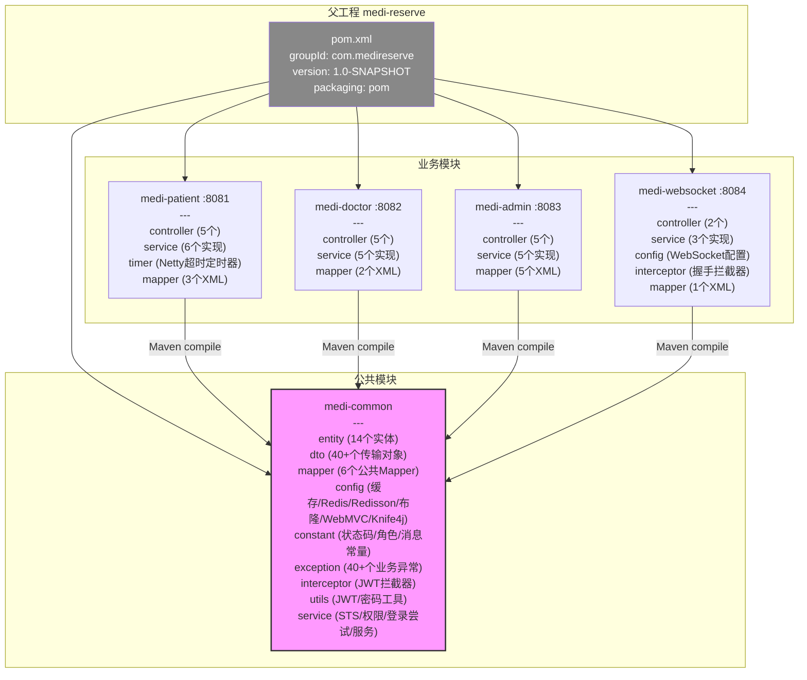
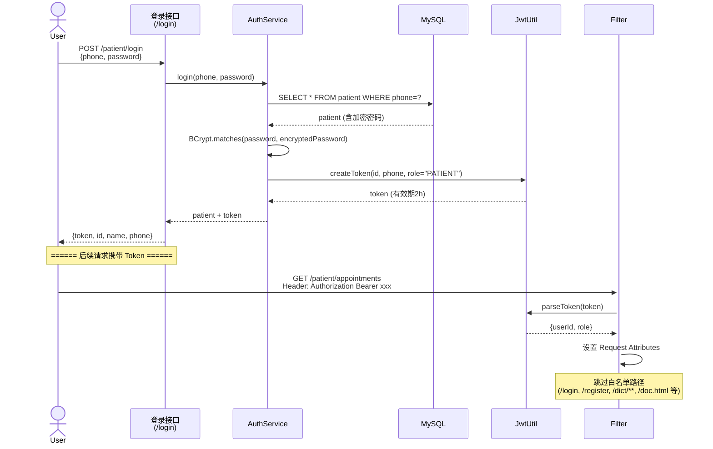

# MediReserve 智慧医疗预约挂号平台 — 项目架构图 

> **版本**：v1.0-SNAPSHOT  
> **最后更新**：2026-07-23

---

## 目录

1. [整体架构图](#一整整体架构图)
2. [技术栈清单](#二技术栈清单)
3. [核心业务流程时序图：预约挂号](#三核心业务流程时序图预约挂号)
4. [缓存架构图](#四缓存架构图)
5. [WebSocket 消息流图](#五websocket-消息流图)
6. [项目模块依赖关系](#六项目模块依赖关系)
7. [安全架构](#七安全架构)

---

## 一、整体架构图



---

## 二、技术栈清单

### 2.1 后端核心技术

| 类别 | 技术 | 版本 | 用途 |
|------|------|------|------|
| **框架** | Spring Boot | 3.3.6 | 应用基础框架 |
| **语言** | Java | 17 | 编程语言 |
| **ORM** | MyBatis + Spring Boot Starter | 3.0.3 | 数据库访问 |
| **分页** | PageHelper Spring Boot | 2.1.0 | 分页查询 |
| **数据库** | MySQL | 8.0 | 关系型数据库 |
| **缓存 L1** | Caffeine | 3.1.8 | 本地缓存（热点数据） |
| **缓存 L2** | Redis (Lettuce) | 7.0 | 分布式缓存 |
| **布隆过滤器** | Guava BloomFilter | 33.2.0-jre | 防缓存穿透 |
| **分布式锁** | Redisson | 3.27.2 | Redis 分布式锁 + 延迟队列 |
| **定时器** | Netty HashedWheelTimer | 4.1.115 | 预约超时取消（时间轮算法） |
| **WebSocket** | Spring WebSocket + STOMP | - | 在线问诊实时通信 |
| **WebSocket 兼容** | SockJS | - | 兼容不原生支持 WebSocket 的浏览器 |
| **认证** | JJWT (io.jsonwebtoken) | 0.12.5 | JWT Token 签发与验证 |
| **密码加密** | Spring Security Crypto | 6.3.5 | BCrypt 密码哈希 |
| **API 文档** | Knife4j (OpenAPI 3.0) | 4.5.0 | 在线 API 文档 + Swagger UI |
| **工具** | Hutool | 5.8.26 | 通用工具类 |
| **简化代码** | Lombok | 1.18.34 | 消除模板代码 |
| **对象存储** | 阿里云 OSS SDK | 3.17.4 | 医生证件文件存储 |
| **STS 认证** | 阿里云 STS SDK | 3.1.1 | 临时凭证安全上传 |

### 2.2 容器化与运维

| 类别 | 技术 | 版本 | 用途 |
|------|------|------|------|
| **构建** | Maven | 3.9.6 | 依赖管理与构建 |
| **容器化** | Docker + Docker Compose | 2.x | 多服务编排 |
| **基础镜像** | eclipse-temurin:17-jre-alpine | - | 轻量级 JRE 镜像 |
| **构建镜像** | maven:3.9.6-eclipse-temurin-17 | - | 多阶段构建 |
| **反向代理** | Nginx Alpine | - | (当前已注释，待启用) |
| **健康检查** | Spring Boot Actuator | - | 容器健康状态检测 |

### 2.3 前端技术（参考）

| 类别 | 技术 | 用途 |
|------|------|------|
| **框架** | Vue 3 | SPA 前端框架 |
| **UI 库** | Element Plus | 组件库 |
| **WebSocket 客户端** | STOMP.js + SockJS | 在线问诊实时通信 |

---

## 三、核心业务流程时序图：预约挂号

> 流程包含：**分布式锁（Redisson）** + **数据库乐观锁** + **Netty 时间轮超时取消**



### 预约状态流转



---

## 四、缓存架构图

> 多级缓存架构：**Caffeine L1（本地）** + **Redis L2（分布式）** + **布隆过滤器（防穿透）**

```mermaid
graph TB
    subgraph "请求层"
        Client[前端请求]
    end

    subgraph "布隆过滤器 Bloom Filter"
        BF_Doctor[医生ID布隆过滤器<br/>Guava BloomFilter<Long><br/>预期插入: 10000, 误判率: 1%]
        BF_Schedule[排班ID布隆过滤器<br/>Guava BloomFilter<Long><br/>预期插入: 1,000,000, 误判率: 1%]
    end

    subgraph "L1 本地缓存 Caffeine"
        CaffeineMgr[CaffeineCacheManager<br/>过期时间: 1小时<br/>最大条数: 1000<br/>允许空值缓存 (防穿透)]
    end

    subgraph "L2 分布式缓存 Redis"
        RedisMgr[RedisCacheManager<br/>过期时间: 5分钟<br/>跨实例共享]
    end

    subgraph "数据库 MySQL"
        DB[(MySQL 8.0)]
    end

    Client --> BF_Doctor
    Client --> BF_Schedule
    BF_Doctor -->|可能存在| CaffeineMgr
    BF_Doctor -->|一定不存在| NotFound[返回空/不存在]
    BF_Schedule -->|可能存在| CaffeineMgr
    BF_Schedule -->|一定不存在| NotFound

    CaffeineMgr -->|Miss| RedisMgr
    CaffeineMgr -->|Hit| Return1[直接返回]
    RedisMgr -->|Miss| DB
    RedisMgr -->|Hit| Return2[回写 Caffeine 后返回]
    DB -->|Found| Return3[回写 Redis → Caffeine 后返回]
    DB -->|Not Found| CacheNull[缓存空值到 Caffeine<br/>防缓存穿透]

    style BF_Doctor fill:#FF9800,color:#fff
    style BF_Schedule fill:#FF9800,color:#fff
    style CaffeineMgr fill:#4CAF50,color:#fff
    style RedisMgr fill:#DC382D,color:#fff
    style DB fill:#4479A1,color:#fff
```

### 缓存使用场景

| 缓存数据 | L1 (Caffeine) | L2 (Redis) | 布隆过滤器 | 刷新策略 |
|---------|--------------|------------|-----------|---------|
| 医生信息 | ✅ 热点数据 | ✅ 跨实例共享 | ✅ 防穿透 | 排班变化时清除 |
| 排班日历 | ✅ 未来7天 | — | ✅ 防穿透 | 创建预约时清除 |
| 热门医生排行 | — | ✅ 手动刷新 | — | 管理员手动触发 |
| 科室/职称字典 | ✅ 静态数据 | — | — | 基本不变 |

---

## 五、WebSocket 消息流图



### WebSocket 架构要点

| 特性 | 实现方式 |
|------|---------|
| **协议** | STOMP over WebSocket |
| **连接端点** | `/ws/chat` (支持 SockJS 兼容) |
| **应用前缀** | `/app` → `@MessageMapping` 处理 |
| **广播频道** | `/topic/room/{appointmentId}` — 按预约 ID 隔离房间 |
| **点对点** | `/user/{userId}/queue/messages` — 备用推送 |
| **认证方式** | 握手拦截器解析 JWT Token → Session Attributes |
| **XSS 防御** | 服务端转义 `<` 和 `>` |
| **离线消息** | Redis 暂存，接收者上线后补发 |
| **消息持久化** | 同步写入 MySQL `consultation_message` 表 |

---

## 六、项目模块依赖关系



### 模块职责说明

| 模块 | 职责 | 是否可独立运行 | 依赖 |
|------|------|--------------|------|
| `medi-common` | 公共代码库（实体、DTO、工具、配置） | ❌ (仅编译依赖) | — |
| `medi-patient` | 患者端业务逻辑 | ✅ | medi-common |
| `medi-doctor` | 医生端业务逻辑 + OSS | ✅ | medi-common |
| `medi-admin` | 管理端业务逻辑 + RBAC | ✅ | medi-common |
| `medi-websocket` | WebSocket 实时通信 | ✅ | medi-common |

> **说明**：各模块之间不通过 HTTP 相互调用，而是通过共享 `medi-common` 模块完成代码复用。模块间数据共享通过共同访问同一个 MySQL 数据库和 Redis 实例实现。

---

## 七、安全架构

### 7.1 认证流程



### 7.2 权限控制体系

| 层次 | 实现 | 说明 |
|------|------|------|
| **JWT 拦截器** | `JwtTokenInterceptor` | 验证 Token 有效性，解析 userId/role |
| **角色注解** | `@RequireRole({ROLE})` | 方法级角色校验（PATIENT / DOCTOR / SUPER_ADMIN / ADMIN） |
| **权限注解** | `@RequirePermission("code")` | 方法级权限校验（RBAC 权限点） |
| **操作日志** | `@LogOperation` + AOP | 自动记录管理员操作到 `operation_log` 表 |
| **密码加密** | BCryptPasswordEncoder | 所有用户密码 BCrypt 加密存储 |

### 7.3 角色权限矩阵

| 角色 | 可访问模块 | 默认权限 |
|------|-----------|---------|
| PATIENT | 患者端 | 自身数据读写 |
| DOCTOR | 医生端 | 自身数据读写 + 排班管理 |
| SUPER_ADMIN (role=1) | 管理端 | 所有权限（13条全开） |
| ADMIN (role=2) | 管理端 | 查看权限（4条只读） |

---

> **更多信息**：请参阅 [部署文档](DEPLOY.md)、[用户手册](USER_MANUAL.md)、[数据库ER图](ER_DIAGRAM.md)。